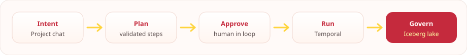
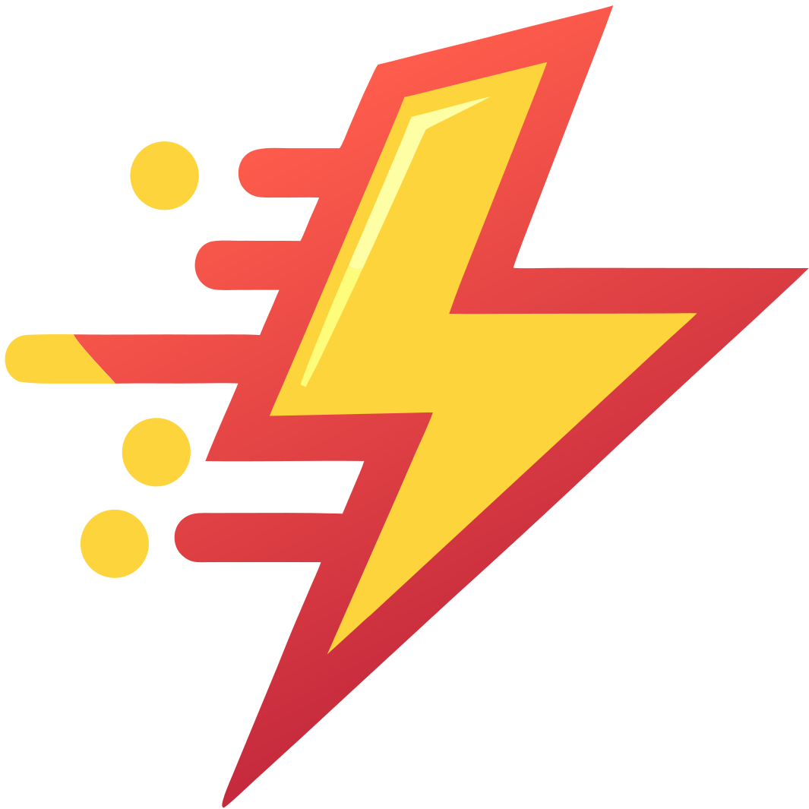

<!--
  blynk-hq organization profile
  Brand assets derived from the product thunder mark (Keycloak login + console).
  SVG only.
-->

  

  

    <a href="https://blynk.ae"><strong>blynk.ae</strong></a>
    ·
    <em>home of blynk HQ</em>
  

---

### Why we build *blynk*

Data platforms got powerful — and operationally heavy. Teams still stitch together
catalogs, query engines, pipelines, identity, and AI tooling by hand, then hope
governance holds under real production load.

**blynk** exists so lakehouse work can move at the speed of intent **without**
giving an LLM a free hand on production systems.

We believe:

- **Humans approve change.** AI proposes; operators decide.
- **Governance is not optional.** Identity, catalog grants, and query policy ship with the plane.
- **Private by default.** The control plane runs in *your* perimeter — local or private cloud.
- **Open foundations, product surface.** Iceberg · Polaris · Trino · SeaTunnel · Temporal, wrapped in one operator console.

---

### What the company does

**blynk HQ** builds the *blynk* platform — an **AI-operated lakehouse control plane**.

Operators work in **Projects** (durable chat workspaces). When a prompt would change
the lake, the embedded agent authors a **Plan**. The console blocks on
**Approve / Edit / Reject**. Only approved plans become Temporal runs that:

| Surface | Engine |
| :--- | :--- |
| Ingest | Apache SeaTunnel → governed **Iceberg** (Polaris catalog) |
| Transform / query | **Trino** with write guards + federated sources |
| Serve | Trino Gateway + Superset |
| Identity | Keycloak OIDC at the edge |

One-liner:

> **Chat intent → validated Plan → human approve → Temporal → governed Iceberg.**

  

---

### Brand

The thunder mark and palette are the same system used on the *blynk* console and
custom Keycloak login theme.

  
   
  

| Token | Hex | Role |
| :--- | :--- | :--- |
| Crimson | `#c52a3d` | Primary / brand |
| Coral | `#ff5d4c` | Hot accent (bolt gradient) |
| Golden yellow | `#fed43d` | Nav / energy |
| Pale accent | `#fefea5` | Highlight |
| Cyan | `#5c8a8a` | Data / surface semantic |
| Type | **DM Sans** | UI + wordmark (*blynk*, lowercase italic) |

---

### HQ

| | |
| :--- | :--- |
| Website | [blynk.ae](https://blynk.ae) |
| GitHub | [github.com/blynk-hq](https://github.com/blynk-hq) |
| Product | [`blynk`](https://github.com/blynk-hq/blynk) — AI lakehouse control plane |

---

  

  
<em>blynk</em> — built for teams who want AI in the lakehouse loop, with humans still holding the keys.

  
<a href="https://blynk.ae">blynk.ae</a>

